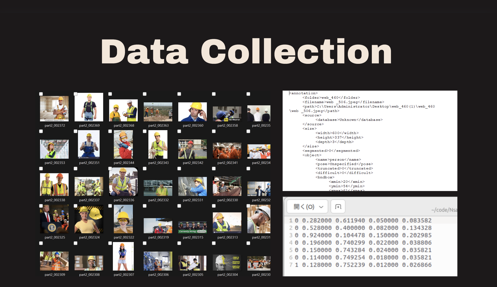
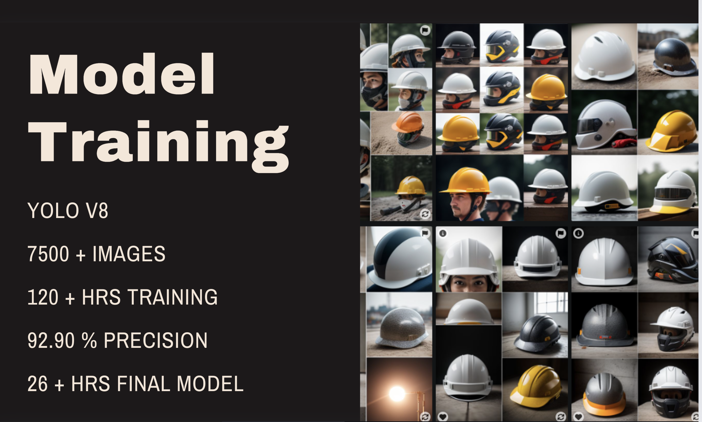
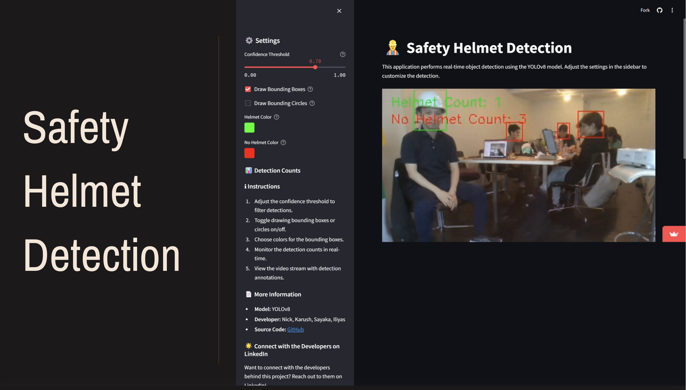
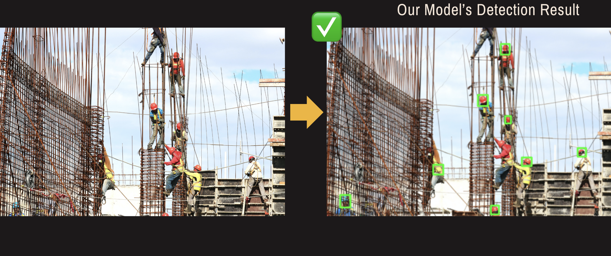

Project Summary: Helmet Detection Application Vision: To enhance workplace safety by detecting helmet usage using machine learning and computer vision.

Motivation: Head injuries are critical in the construction industry. Statistics show around 2,200 deaths from head injuries between 2003 and 2010.

Data Collection and Preparation: Collected high-quality images from https://pan.baidu.com/s/1UbFkGm4EppdAU660Vu7SdQ. Reformatted annotations to YOLO format.

Model Training:

Used YOLOv5 and YOLOv8. Over 120 hours of training, 26 hours for the final model. Utilized 7,500 images, achieving 92.90% precision. Application Development:

Developed with Streamlit and OpenCV. Overcame real-time video processing challenges. Efficiently processes live video feeds to detect helmet usage.

Demo: The app identifies individuals not wearing helmets and updates the count in real-time. It is designed for use on construction sites to notify managers of safety compliance. https://helmetdet-app.streamlit.app/

Our model can detect also images far from the sight which google PPE detector can't do it. https://cloud.google.com/vision-ai/docs/ppe-detector-model
